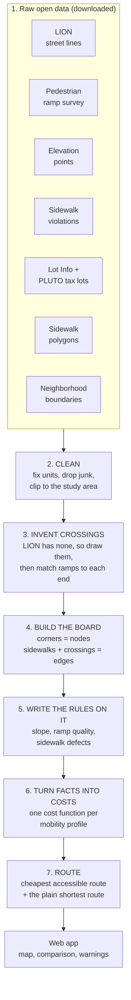
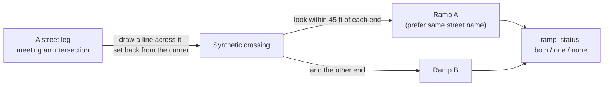
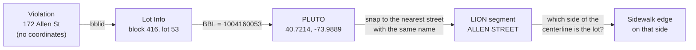

# ClearCurb data guide

**What data we use, what it looks like, and how we turn it into a wheelchair-accessible route.**

This guide is written for someone who has never worked with maps or city data. Every technical term is explained the first time it appears, and there is a [glossary](#8-glossary) at the end. Every number in it was measured from the real data on the machine that built the routing graph (lower Manhattan, community districts 1-3), not estimated.

> **How to read the status tags.** Each dataset below carries one of three tags:
> **[USED]** feeds the routing engine today. **[PARTLY]** is used in a limited way. **[NOT YET]** is downloaded and cleaned, but no routing logic reads it yet.

---

## Contents

1. [The big picture](#1-the-big-picture)
2. [The pipeline at a glance](#2-the-pipeline-at-a-glance)
3. [The datasets](#3-the-datasets)
4. [Stitching it together](#4-stitching-it-together-from-messy-pieces-to-a-route)
5. [Three worked examples](#5-three-worked-examples-with-real-data)
6. [What can go wrong: data quality and honest limits](#6-what-can-go-wrong-data-quality-and-honest-limits)
7. [How fresh is everything?](#7-how-fresh-is-everything)
8. [Glossary](#8-glossary)
9. [Appendix: files, commands, and corrections](#9-appendix)

---

## 1. The big picture

### The problem

A normal map app asks: *what is the shortest way?*
ClearCurb asks: *what is a way I can actually use?*

For someone in a wheelchair or using a walker, the shortest path can be blocked by a corner with no curb ramp, a steep block, a step street, or a sidewalk with a broken slab. No single city dataset says "this route works for you." Instead the city publishes a dozen separate datasets, each describing one small piece of the street, in different formats, with different IDs, different units, and different levels of quality.

Our job is to **take those pieces and assemble them into one map that can answer the question**.

### Four questions, four kinds of data

| The question a wheelchair user needs answered | What answers it | Dataset |
|---|---|---|
| **Where can I even walk?** | The street network: which streets connect to which | LION street centerlines |
| **Is it too steep?** | Ground height at many points | Elevation points |
| **Can I get across the street?** | Whether a curb ramp exists at each crosswalk, and how good it is | Pedestrian ramp survey |
| **Is the sidewalk in good shape?** | Reported sidewalk defects | Sidewalk violations |

Everything else in this guide is either *glue* (datasets that let those four talk to each other) or *plumbing* (steps that clean them up).

### The mental model: a board game

Picture the finished product as a **board game**:

- Every **street corner** is a **square** on the board (we call these *nodes*).
- Every **stretch of sidewalk** and every **crosswalk** is a **path between two squares** (we call these *edges*).
- Each path carries **rules written on it**: "steep: 6% grade", "no curb ramp at one end", "trip hazard reported".
- The **router** is a player who wants to get from A to B as cheaply as possible. What "cheap" means depends on who is playing: a manual wheelchair user gets penalised heavily by slopes, a power chair less so, a walker user can step over a curb that would stop a wheelchair.

The raw data does not come in that shape. It comes as road lines with no sidewalks, ramp points with no link to the road, and defect reports with no location. **The pipeline builds the board and writes the rules onto it.**

### The whole flow in one picture



---

## 2. The pipeline at a glance

All data lives under `backend/data/`, which is **gitignored**. That means none of it comes from git: every machine generates its own copy by running the scripts. `raw/` holds untouched downloads; `processed/` holds cleaned data and the finished graph. Raw files are never modified, so the whole chain is safe to re-run.

**Run order** (each step needs the ones above it):

| # | Script | Reads | Writes (in `data/`) |
|---|---|---|---|
| 1 | `fetch_curbs.py` | Curbs + neighborhood boundaries (Socrata) | `raw/curbs_lower_manhattan.geojson`, `raw/neighborhoods.geojson` |
| 2 | `fetch_network_data.py` | Sidewalk polygons, elevation points, LION, raised crosswalks | `raw/sidewalks_…`, `raw/elevation_points_…`, `raw/lion_…`, `raw/raised_crosswalks_…` (`.parquet`) |
| 3 | `download_ramps.py` | Pedestrian ramp survey | `raw/ramps_lowermanhattan.parquet` |
| 4 | `download_sidewalk_data.py` | Violations, lot info, inspections | `raw/violations_…csv`, `raw/lots_manhattan.csv`, `raw/inspections.csv` |
| 5 | `build_crossings.py` | LION, ramps, raised crosswalks | `raw/crossings_lowermanhattan.parquet` |
| 6 | `clean_data.py` | Everything in `raw/` | `processed/` cleaned layers |
| 7 | `build_graph.py` | Cleaned LION, crossings, sidewalks | `processed/graph_nodes.parquet`, `graph_edges.parquet` |
| 8 | `locate_violations.py` | Violations, lots, LION (+ downloads PLUTO) | `processed/violations_located.parquet` |
| 9 | `attach_attributes.py` | Graph, elevation, violations, crossings, ramps | `processed/graph_nodes_attrs.parquet`, `graph_edges_attrs.parquet` |

The backend (`backend/app/`) loads the two `*_attrs.parquet` files at startup. **If they do not exist, the API answers `/api/route` with "Routing graph not built."**

Extra downloads that the routing pipeline does not use yet: `download_dem.py` (elevation rasters), `download_elevation_points.py` (a spot-elevation subset), `download_sidewalk_repairs.py` (repair history).

Most sources are queried through **Socrata**, the API behind NYC Open Data. Setting the environment variable `SOCRATA_APP_TOKEN` (free) raises the rate limit but is optional at our size.

**Which area?** "Lower Manhattan" means the eight 2020 neighborhood areas in Manhattan community districts 1-3, roughly everything south of 14th Street (see [3.2](#32-neighborhood-boundaries-nta-2020-used)). Several raw downloads first use a slightly larger rectangle (40.700-40.740 N, -74.020 to -73.970 W); `clean_data.py` then clips everything to the neighborhoods plus a 150 ft buffer so all layers cover the same ground.

---

## 3. The datasets

Thirteen sources plus a basemap. They fall into five groups:

| Group | Datasets |
|---|---|
| **A. The map skeleton** | LION streets, neighborhood boundaries, sidewalk polygons, curbs |
| **B. Slope** | Elevation points, elevation rasters (DEM) |
| **C. Ramps and crossings** | Pedestrian ramps, raised crosswalks |
| **D. Sidewalk condition** | Violations, lot info, PLUTO, inspections, repair history |
| **E. Display** | Basemap tiles |

Quick reference (details follow):

| Dataset | ID | Rows in our area | Status |
|---|---|---|---|
| LION streets | `2v4z-66xt` | 11,809 → 3,829 walkable | **[USED]** the backbone |
| Neighborhood boundaries | `9nt8-h7nd` | 8 polygons | **[USED]** defines the area |
| Sidewalk polygons | `52n9-sdep` | 1,675 → 1,272 | **[PARTLY]** sanity check only |
| Curbs | `5xvt-8cbk` | 6,615 | **[NOT YET]** |
| Elevation points | `9uxf-ng6q` | 24,001 → 8,126 ground points | **[USED]** slope |
| Elevation rasters (DEM) | NYS ImageServer | 4,674 × 5,389 pixels | **[NOT YET]** |
| Pedestrian ramps | `ufzp-rrqu` | 6,771 → 6,117 | **[USED]** curb-cut quality |
| Raised crosswalks | `uh2s-ftgh` | 1 (145 citywide) | **[USED]** |
| Sidewalk violations | `6kbp-uz6m` | 6,263 | **[USED]** |
| Lot Info | `i642-2fxq` | 191,229 (Manhattan) | **[USED]** glue |
| PLUTO tax lots | `64uk-42ks` | 10,379 | **[USED]** glue |
| Inspections | `dntt-gqwq` | 403,024 (citywide) | **[NOT YET]** |
| Repair history | `ugc8-s3f6` | 774 | **[NOT YET]** |

### A. The map skeleton

#### 3.1 LION: street centerlines **[USED]**

**What it is.** LION ("Linear Integrated Ordered Network") is the Department of City Planning's street base map. Every street is drawn as a single line from one intersection to the next. Each of those stretches is a **segment**, and each intersection is a **node** with an ID. Segments say which node they start and end at, so LION is already a network.

**The catch for us.** LION describes the *roadway*. It has **no sidewalks and no crosswalks**. We have to construct both ([Step 3](#step-3--invent-the-crossings-lion-does-not-have) and [Step 4](#step-4--build-the-board)).

**Source.** DCP; downloaded as a 46 MB file geodatabase (`nyclion.zip`) linked from the Socrata page. The Socrata page shows "updated 2013", which is stale metadata: the file has 2020 census columns, so it is a recent release. Our script does not record the exact release date.

**One record looks like** (Allen Street):

```
SegmentID        0032859
Street           ALLEN STREET
RW_TYPE          1              (roadway type: 1 = ordinary street, 7 = step street)
NodeIDFrom       …              (intersection at one end)
NodeIDTo         …              (intersection at the other end)
StreetWidth_Max  44.0           (feet)
SHAPE_Length     456            (feet)
```

**Fields we keep** (out of 130; most of the rest are voting districts, census tracts and address ranges):

| Field | Meaning | Why we need it |
|---|---|---|
| `SegmentID` | Unique ID of the street stretch | The key that everything else attaches to |
| `Street` | Street name | Matching ramps and violations by name |
| `NodeIDFrom` / `NodeIDTo` | Intersection IDs at each end | The network's connectivity; where corners go |
| `RW_TYPE` | Roadway type. We keep `1` (street) and `7` (step street) | Excluding highways, bridges, etc. |
| `NonPed` | A non-blank value marks a segment that is not a pedestrian way | Dropping those segments |
| `StreetWidth_Min` / `_Max` | Roadbed width in feet | How far to place sidewalks from the centerline, and how long a crosswalk is |
| `SHAPE_Length` | Segment length in feet | Grade = height change ÷ length |
| `TrafDir`, `BikeLane`, `POSTED_SPEED` | Traffic direction, bike lane, speed limit | Kept for future use |
| `is_step_street` | **We add this**: true when `RW_TYPE = 7` | Step streets are impassable for wheelchairs |

**What is messy.**

- 130 columns, most irrelevant. Text fields are padded with spaces (`' 9'`, `'  '`), so everything must be trimmed before comparing.
- The download also picks up Brooklyn streets across the East River (**1,162 rows have Brooklyn on their left side**); we keep Manhattan only.
- **41% of segments have no usable street width** (missing, or under 16 ft). We substitute 30 ft. This affects sidewalk placement and crossing length.
- Only **11 step streets** exist in the area. Most other raw rows are other roadway types or non-street features, which we drop.

**Why it matters.** It is the foundation. Corners sit at LION nodes, sidewalks are offsets of LION lines, and crossings are drawn across LION legs. **After cleaning: 3,829 walkable segments.**

#### 3.2 Neighborhood boundaries (NTA 2020) **[USED]**

**What it is.** Neighborhood Tabulation Areas: polygons DCP uses to group census data into neighborhoods. Ours are the eight NTAs of Manhattan community districts 1-3.

**Fields.** `nta2020` (code), `ntaname`, `cdtaname`, and the boundary polygon. Published by DCP (dataset `9nt8-h7nd`, updated 2026-05-28; the boundaries themselves are a fixed 2020 definition).

| Code | Neighborhood |
|---|---|
| MN0101 | Financial District-Battery Park City |
| MN0102 | Tribeca-Civic Center |
| MN0201 | SoHo-Little Italy-Hudson Square |
| MN0202 | Greenwich Village |
| MN0203 | West Village |
| MN0301 | Chinatown-Two Bridges |
| MN0302 | Lower East Side |
| MN0303 | East Village |

(MN0191, the Battery and the harbor islands, is excluded because it is mostly islands.)

**Why it matters.** "Lower Manhattan" is not an official boundary, so this is how we define it. Every layer is clipped to these polygons plus a 150 ft buffer so that crossings at the edge do not lose half their neighbors. The shared definition lives in `scripts/lower_manhattan.py`.

#### 3.3 Sidewalk polygons **[PARTLY]**

**What it is.** From NYC's Planimetric Database, traced from aerial photos: one polygon per patch of sidewalk (dataset `52n9-sdep`, updated 2024-04-24).

**Fields.** `shape_area` (square feet), `feat_code` (`3800` for all), `sub_code` (`380000` or `380010`), `source_id`, `status`, and the polygon itself. 1,675 polygons in the area; median size 9,220 sq ft. After cleaning, 1,272 remain (we drop shapes under 25 sq ft, which are drafting noise, plus duplicates and anything outside the study area).

**How it is used.** Only as a **sanity check**. Because LION has no sidewalks, we *model* each sidewalk as a line offset from the street centerline. `build_graph.py` then measures how much of each modeled sidewalk actually lies on a real sidewalk polygon: the median edge overlaps 100%, but **22% of edges overlap less than half**, a rough measure of where the model is likely off (for example, where the real street layout differs from a simple centerline offset).

**Why it could matter more.** These polygons hold the real shape of the walkable surface, so they could give sidewalk **width** (narrow sidewalks are a real barrier) and more precise geometry. Nothing does that yet.

#### 3.4 Curbs **[NOT YET]**

**What it is.** Every curb line where road meets sidewalk, again from the Planimetric Database (`5xvt-8cbk`, updated 2024-04-24). Our area has **6,615 line segments, about 245 miles** of curb.

**Fields.** `row_id` (our unique key), `source_id`, `feat_code` / `sub_code` (a single class, `2250`), `status` (Unchanged 5,835 / Updated 519 / New 261 since the previous capture), `shape_leng`, plus the neighborhood we tag it with.

**What it does *not* contain.** Anything about ramps or curb cuts. It only says where a curb line exists, not whether it has a ramp, so it cannot answer "can I cross here?" by itself.

**Status.** Cleaned into `processed/curbs.parquet`, but no routing step reads it. Its promise is validating that a crossing really passes over a curb and improving corner geometry.

### B. Slope

#### 3.5 Elevation points **[USED]**

**What it is.** From the Planimetric Database: thousands of individual points, each with a height above sea level. Dataset `9uxf-ng6q` (1.47 million points citywide, updated 2024-04-24). The Socrata page linked in our early notes (`szwg-xci6`) is a map wrapper with no queryable data; this is the real table.

**Fields.** `elevation` (**feet**, NAVD88), `feat_code`, `sub_code`, `source_id`, `status`, and the point location.

**One record:**
```
feat_code 3000 (ground/spot)   elevation 8.92   status Unchanged   POINT(-73.911 40.620)
```

**What is messy.** The points are **not all ground**. Of the 24,001 in our rectangle:

| `feat_code` | Meaning | Count | Useful for street slope? |
|---|---|---|---|
| `3020` | **Building roof** (highest point of the roof) | 13,144 (55%) | No, and values run up to 1,413 ft |
| `3000` | Spot elevation on the ground, plus bridge decks | 10,854 | Yes (bridge decks are a caveat) |
| `3010` | Standing water | 3 | Harmless |

**Cleaning.** Keep ground and water codes only, and drop anything outside -5 to 50 ft (higher points here are mostly the Brooklyn Bridge deck). **8,126 points remain** (median 17.2 ft, range -4.8 to 49.9 ft).

**Why it matters.** Slope is the only way to know a block is too steep. See [Step 5](#step-5--write-the-rules-onto-the-board) for how heights become a grade percentage.

#### 3.6 Elevation rasters (DEM) **[NOT YET]**

**What it is.** A **raster** is a grid of pixels, like a photo, but each pixel holds a height instead of a colour. A DEM ("digital elevation model") is the bare ground with buildings and trees removed. We download two, from NYS's map server:

| Source | What it is |
|---|---|
| `NYC_TopoBathymetric_2017_1_meter` | NYC's 2017 LiDAR (laser scanning from aircraft) ground model, 1 m pixels |
| `Latest_DEM` | New York State's statewide 1 m mosaic |

For Manhattan **these are identical**: the state mosaic uses the NYC 2017 data on top. (Two early notes were wrong: the service name `…_1_foot` does not exist, and the values are **meters**, not feet.)

**Our copy.** 4,674 × 5,389 pixels at 1 m, in State Plane feet (EPSG:2263), **elevation in meters**, NAVD88 datum. Heights range -14.0 m (the river bottom; the model includes water depth) to 28.1 m. 80% of the rectangle has data (the rest is beyond the model, mostly rivers). It covers essentially all of the neighborhoods (99.7-100% of each).

**Why it matters, and why it is unused.** A raster describes the *whole surface*, so it could measure slope along the actual sidewalk instead of averaging between intersections (see [limits](#6-what-can-go-wrong-data-quality-and-honest-limits)). It is downloaded and verified (its heights match the spot elevation points closely: median difference under half a foot, and 95% within 3 ft) but `attach_attributes.py` currently computes slope from the points.

### C. Ramps and crossings

#### 3.7 Pedestrian ramps **[USED]**

**What it is.** DOT's survey of every curb ramp: a point at each corner with measurements of the ramp. This is **the only source that says whether a crossing has a curb cut and how good it is**, which makes it the single most important dataset for the app. Dataset `ufzp-rrqu`, published 2021-10-27.

**When it was surveyed.** 2017-2019, and **6,647 of the 6,771 ramps in our area were surveyed in 2018**. It describes the street as it was about eight years ago.

**One record** (ramp 125546, 2 Avenue at E 9 St):
```
ramp_onstr               2 AVENUE          the street the ramp is on
stname1 / stname2        EAST 9 STREET / 2 AVENUE   the corner's two streets
ramp_running_slope_total 5.8               how steep the ramp is (%)
ramp_cross_slope         -1.5              sideways tilt (%)
curb_reveal              0.8               lip where ramp meets road (inches)
ramp_width               48.6
dws_conditions           Good Condition    detectable warning surface (bumpy tiles)
```

**Fields that matter.**

| Field | Meaning | How we use it |
|---|---|---|
| `rampid`, `cornerid` | IDs | Identity |
| `ramp_onstr`, `stname1`, `stname2` | Street names | Match the ramp to the right crosswalk |
| `ramp_running_slope_total` | Steepness of the ramp | Compare to the 8.33% (1:12) ADA limit; block or penalise |
| `ramp_cross_slope` | Sideways tilt | Penalise above 2% |
| `curb_reveal` | Height of the lip at the bottom of the ramp | **Wheelchair front casters catch on lips**; block or penalise |
| `dws_conditions` | Detectable warnings: Good 4,354 / **Missing 2,251 (33%)** / Defective 147 | Stored, but **not used in costs yet**; matters most for blind pedestrians |
| `ramp_width`, `ramp_length`, flares, `lnd_*` (landing) | Geometry | Kept for future use (minimum width) |
| `ponding`, `obstacles_ramp`, `obstacles_landing` | Water, obstructions | Kept, unused |

**What is messy.**

- **Every field arrives as text**, including numbers. We convert.
- **`999` means "not measured"**, in 468 ramps (6.9%). Left as-is it would read as a 999% slope, so we convert to *unknown* (null).
- Units are not spelled out in the data we fetch. The code **assumes slopes are percent and `curb_reveal` is inches**, which is consistent with the values (median slope 6.7, median reveal 0.7).
- Some values look odd (a `ramp_length` of -8.9), which are ignored unless used.
- A ramp is a **point**. Nothing links it to a street segment or a crosswalk; we match by proximity and street name ([Step 3](#step-3--invent-the-crossings-lion-does-not-have)).

**After cleaning: 6,117 ramps** (clipped to the area, one row per `rampid`).

#### 3.8 Raised crosswalks **[USED]**

**What it is.** DOT's list of crosswalks raised to sidewalk level (dataset `uh2s-ftgh`, updated 2026-09-02). A raised crosswalk needs no ramp at all. Fields: `treatment`, `date`, `nodeid` (the LION intersection), and an x/y location in State Plane feet.

**The numbers are tiny:** 145 citywide and **only 1 in our area**, so it flags 7 crossings. It is included because it is correct and cheap, and matters much more citywide.

### D. Sidewalk condition

Four datasets from DOT's **Sidewalk Management Database (SMD)**, plus PLUTO from City Planning. They only make sense together, because **the violations have no coordinates**.

#### 3.9 Sidewalk violations **[USED]**

**What it is.** A record for each time DOT cited a property owner for a defective sidewalk (dataset `6kbp-uz6m`, last updated 2026-09-19). 6,263 in community boards 1-3 across 5,508 different lots.

**One record:**
```
violationid   1826
house_num     172
onstname      ALLEN STREET            (frstname RIVINGTON ST, tostname STANTON ST)
vissuedate    2001-03-07
trip_haz X    broken X    undermined X    slope X          ← defect flags
sq_feet       1435
bblid         16455                    ← the lot, but NOT coordinates
```

**Fields that matter.**

| Field | Meaning |
|---|---|
| `violationid`, `bblid` | The violation, and the tax lot it was issued to |
| `house_num`, `onstname`, `frstname`, `tostname` | The address and the block it sits on |
| `vissuedate`, `vdismissdate`, `certi_date` | Issued / dismissed / repair certified |
| `trip_haz`, `broken`, `slope`, `undermined`, `sw_missing`, `patchwork`, `hardware`, `integrity`, `flag`, `other_def` | Defect flags |
| `sq_feet`, `contract`, `grace_pd` | Size of the defect, repair contract, days to comply |

**What is messy.**

- **No latitude/longitude.** It has a lot ID and a street address, nothing you can draw ([the location chain](#step-5--write-the-rules-onto-the-board) fixes this).
- Defect flags are `'X'` or blank. `other_def` is free text ("6A STRUCTURAL INTEGRITY", "6A-STRUCTURAL INTEGRITY": same thing, different spelling). Street names have stray double spaces.
- **"Open" is a weak signal.** We call a violation *open* when it has **no dismissal date and no certification date**: 1,510 of 6,263. But among open violations with a known location, **88% are over 5 years old, 69% over 15 years, and the median is 22 years**. A 2001 violation with no closing paperwork may long since have been fixed. See [limits](#6-what-can-go-wrong-data-quality-and-honest-limits).

**Cleaning.** Dates parsed, flags to true/false, an `is_open` flag added, names normalised, duplicates removed.

#### 3.10 Lot Info **[USED]** (the glue)

**What it is.** A lookup table in the same database: 191,229 Manhattan lots. Fields: `bblid` (the SMD's own lot ID), `boro`, `block`, `lot`, `zipcode`.

**Why it matters.** It is a translator. A violation knows its `bblid`; NYC's other datasets know a lot by **BBL** (Borough-Block-Lot, a 10-digit number). This table converts one to the other: **`BBL = boro × 1,000,000,000 + block × 10,000 + lot`** (for example borough 1, block 416, lot 53 becomes `1004160053`).

#### 3.11 PLUTO: tax lots **[USED]** (the glue)

**What it is.** City Planning's land-use file with one row per tax lot (dataset `64uk-42ks`, updated 2026-08-24). We fetch just four fields for community districts 1-3: `bbl`, `latitude`, `longitude`, `address` (10,379 lots).

**Why it matters.** PLUTO is where a lot finally gets **a point on the map**. It is the middle of the lot, not the sidewalk, so a violation's location is only accurate to "the block face in front of this lot". **561 violations (9%) have no matching PLUTO lot** (condo billing lots, or lots renumbered since) and cannot be placed.

#### 3.12 Inspections **[NOT YET]**

**What it is.** Every inspection DOT has run (dataset `dntt-gqwq`, last updated 2026-09-19): **403,024 rows citywide**. Fields include `inspectionid`, `inspectiondate`, `noviolationfound` (Yes/No), `citydoit`, `ownerwilldoit`, `is_311_inspection`, `damagetypecode`.

**Also messy:** its dates run from the year **1859 to 9862**, so any use would need those cleaned first.

**Why it is unused.** It has **no location and no lot ID**, so it cannot be tied to a place. The tempting idea is that it would let us tell *"inspected and found clean"* from *"never inspected"*, which is the difference between good news and no news. The design mocks up exactly this idea (a "data confidence" bar). Without a way to place it on the map, it stays on the shelf.

#### 3.13 Repair history (SMD "Built") **[NOT YET]**

**What it is.** Which lots have had sidewalk repairs, by DOT contract or by the owner (dataset `ugc8-s3f6`, updated 2026-06-04; 105,990 rows citywide, **774 in our area**, matched to lower Manhattan through the violations). Fields: `bblid`, `dot_contstruct_date`, `contract`, `dbo` / `dbo_date` (done by owner), `totalsqftsidewalkrepaired`, `totallfcurbrepaired`, `totalcosttoconstruct`, and tree-damage flags.

**Why it matters.** It answers the biggest open question about violations: *has it been fixed?* A repair dated after a violation suggests the defect is gone, which would remove many of those decades-old "open" violations. **Gaps:** it is per-lot, not per-spot; **120 of the 774 have no repair date at all**; and 513 owner repairs carry a flag but no date.

### E. Display

#### 3.14 Basemap tiles **[display only]**

The map's street backdrop comes from OpenStreetMap raster tiles, desaturated to grey so that colour is reserved for routes and hazards. It plays no part in routing. OpenStreetMap's public tile server is meant for development, so a real provider should replace it before launch (`NEXT_PUBLIC_BASEMAP_STYLE_URL` accepts any style URL).

---

## 4. Stitching it together: from messy pieces to a route

Here is the honest one-paragraph version. **We start with a road map that has no sidewalks, a list of ramp points that connect to nothing, a spreadsheet of complaints with no addresses on a map, and a cloud of height measurements, half of which are the tops of buildings. We invent the missing sidewalks and crosswalks from the road lines, glue each ramp and complaint to the right one by location and street name, turn the heights into slopes, and write all of it onto a single network. Then a cost function says how painful each piece is for each kind of user.**

Each step below follows the same shape: **the problem, what we do, what we get.**

### Step 1 · Decide what "lower Manhattan" means

- **Problem:** the raw downloads use a rough rectangle, and each dataset covers a different footprint.
- **Do:** union the eight neighborhood polygons, add a 150 ft buffer, and clip everything to it. Features that touch the area are kept whole (never sliced into slivers).
- **Get:** every layer covers the same ground.

### Step 2 · Clean each layer

Raw data is never edited; cleaned copies go to `processed/` in one consistent coordinate system, **EPSG:2263** (New York State Plane, measured in feet). Feet matter because slopes and distances need one consistent unit.

| Layer | Raw → clean | What we fixed, and why |
|---|---|---|
| LION streets | 11,809 → 3,829 | Keep Manhattan pedestrian streets and step streets only; trim padded text; drop non-pedestrian and Brooklyn rows |
| Sidewalk polygons | 1,675 → 1,272 | Repair broken shapes; drop slivers under 25 sq ft and duplicates |
| Elevation points | 24,001 → 8,126 | Drop roof points (up to 1,413 ft) and bridge/outlier heights; keep -5 to 50 ft |
| Ramps | 6,771 → 6,117 | Text to numbers; **`999` → unknown**; one row per ramp; flag missing/defective warning tiles |
| Crossings | 8,890 → 5,677 | Clip to the area; drop duplicate lines at dual-carriageway intersections |
| Curbs | 6,615 → 6,615 | Repair shapes; drop zero-length lines and duplicates |
| Violations | 6,263 → 6,263 | Parse dates; flags to true/false; compute `is_open`; normalise names; dedupe |

Rule of thumb throughout: **unknown stays unknown.** A missing measurement becomes a null, never a zero and never a guess, and (as [Step 6](#step-6--turn-facts-into-costs) explains) a null never blocks a route.

### Step 3 · Invent the crossings LION does not have

- **Problem:** LION has streets but **no crosswalks**, and the ramp survey has **points, not crossings**. To ask "does this crossing have a ramp?" there must first be a crossing to ask about.
- **Do, part one, draw the crossings.** At every real intersection (a node where 3 or more walkable streets meet: **2,003 of them**), draw one crossing across **each** street that meets it. Each crossing is a line **perpendicular to the street**, set back from the intersection by half the cross street's width plus 8 ft, and as long as the street is wide plus 4 ft of sidewalk on each side.
- **Do, part two, find the ramps.** For each end of each crossing, look for a surveyed ramp within **45 ft**. If several are near, **prefer the one whose street name matches** the street being crossed (`ramp_onstr`), then the closest.
- **Get:** each crossing is labelled by how many ends have a ramp.

| `ramp_status` | Meaning | Count (all crossings) |
|---|---|---|
| `both` | A ramp at each end | 5,909 |
| `one` | A ramp at one end only | 895 |
| `none` | No ramp found at either end | 2,086 |

(Counts are for all 8,890 crossings drawn. After clipping to the study area, the graph has 5,675 crossings: **4,061 both, 573 one, 1,041 none**.)

91% of matches agreed on street name. It also carries the matched ramps' slopes, lip heights and warning-tile states, and flags crossings at a raised-crosswalk node.



### Step 4 · Build the board

- **Problem:** the pieces need to become one connected network where you can walk from any corner to any other.
- **Do:**
  - **Corners (nodes).** At every LION intersection, place one corner in each gap between neighbouring streets. A 4-way intersection gets 4 corners; a dead end gets 1. A corner sits where the two adjacent streets' curb lines would meet: each street's edge is offset from its centerline by **half the street's width plus 4 ft**.
  - **Sidewalk edges.** For every street segment, draw **one sidewalk per side**, an offset of the centerline running between the corner at each end.
  - **Crossing edges.** Link the two corners on either side of each street using the crossings from Step 3.
  - **Step streets** become their own edges (with tiny "link" edges joining them to nearby corners).

```
              │         │
              │  north  │            ═ ║  crossing edges (across a street)
              │  street │            ─ │  sidewalk edges (along a street)
   ───────── NW ═══════ NE ─────────  NW NE SW SE = the four corner nodes
   west st.   ║         ║   east st.
   ───────── SW ═══════ SE ─────────
              │  south  │
              │  street │
```

- **Get** (a real result): **7,654 nodes and 13,330 edges**: 7,644 sidewalk, 5,675 crossing, 7 step, 4 link. **99.7% of nodes are in one connected piece** (seven pieces in total; the other six hold only 2-8 nodes each), so almost any two corners are reachable.

> **Note.** This is a *model*: the sidewalks are inferred from road lines, not surveyed. That is why the sanity check against real sidewalk polygons exists (Section 3.3).

### Step 5 · Write the rules onto the board

The board now has the right shape but no rules. Each fact arrives by a different route.

#### 5a. Slope: from scattered heights to a grade

- **Problem:** heights are scattered points, often nowhere near an intersection.
- **Do:** estimate the height *at each LION intersection* by blending nearby ground points: look within 150 ft (widening once to 300 ft) and need **at least 3** points; nearer points count more (weight = 1 ÷ distance², distance floored at 5 ft). This is called **inverse-distance weighting**. Then:

  > **grade % = 100 × (height at the far end − height at the near end) ÷ segment length**

  The result is signed: positive means uphill in the direction of travel.
- **Get:** height for 99.9% of intersections; a grade on 99.9% of sidewalk edges. Typical grades: **median 0.8%, 90th percentile 2.2%, 99th percentile 5.1%**; only 1.1% of edges exceed 5% and 0.4% exceed 8.33%.
- **Honesty flag:** grade on a segment under 60 ft is **marked unreliable** (30% of sidewalk edges). A few feet of measurement error swings a short block wildly, so the router will never hard-block one for grade. Crossings get no grade at all (heights cannot resolve a slope *across* a street); the ramp's own slope is the signal there.

#### 5b. Ramps: onto the crossings

Each crossing edge receives the numbers from its matched ramps: `ramp_status`, the steepest running slope of the two ends, the largest cross slope, the tallest lip, whether warning tiles are missing or defective, and whether it is raised. For a crossing with no data on a measurement, that field stays **unknown**.

#### 5c. Violations: giving complaints an address on the map

Violations have no coordinates, so we build a chain that puts each one on a specific sidewalk:



1. `bblid` → Lot Info → block and lot → **BBL**.
2. BBL → PLUTO → **latitude and longitude** of the lot.
3. Snap that point to a nearby street segment (within 150 ft), **preferring a segment whose name matches the violation's street** so a corner lot doesn't attach to the wrong street. Median snap distance is 75 ft.
4. Work out **which side of the street** the lot is on (left or right of the centerline).
5. Add the violation to that side's sidewalk edge, keeping **open violations that matched by street name**.

**Get:** of 6,263 violations, 5,702 are located and 5,616 snap to a street; **1,307 open, name-matched violations** are attached, touching **835 sidewalk edges** (10.9% of all sidewalk edges), 599 with a trip hazard. The other side of a street does *not* inherit the penalty, so a route can cross to the clean side.

### Step 6 · Turn facts into costs

- **Problem:** the board has rules, but the router needs one number per edge.
- **Do:** the file `backend/app/profiles.py` scores every edge for a given **mobility profile**. The scale: **a flat, clean sidewalk costs exactly its length in feet.** Anything wrong either multiplies that cost or adds a fixed penalty (in "feet-equivalent"). An edge the profile cannot use at all costs "infinite" and is removed (**blocked**). A person could walk 500 extra feet to avoid a 500-point penalty, so penalties read as *detour I'd accept*.

**Profiles.** The numbers are starting assumptions anchored to ADA figures (5% for a walkable route, 8.33% ramp slope, 2% cross slope, 0.5 in lip), loosened or tightened per profile. They are **not clinical guidance** and should be tuned with real users.

| | Manual wheelchair | Power wheelchair | Walker / crutches |
|---|---|---|---|
| Comfortable grade / **blocked above** | 3% / **8.33%** | 5% / **12%** | 4% / **12%** |
| Cost added per % over comfortable (uphill extra) | +0.35 (+0.5) | +0.15 (+0.1) | +0.30 (+0.4) |
| Ramp running slope: fine / **blocked above** | 8.33% / **15%** | 8.33% / **20%** | 8.33% / never |
| Curb lip: fine / **blocked above** | 0.5 in / **2 in** | 1 in / **3 in** | 0.5 in / **3 in** |
| **Crossing with no verified ramp** | **Blocked** | **Blocked** | +400 ft penalty (can step the curb) |
| Step streets | **Blocked** | **Blocked** | Allowed at 8× length |
| Fixed cost of any crossing (waiting, time) | 30 ft | 30 ft | 50 ft |
| Walking speed for the time estimate | 260 ft/min | 300 ft/min | 160 ft/min |

Other rules:

- **Open violations** add to an edge's multiplier: +0.3 for having any open violation, plus extra for a trip hazard (+0.5 manual), undermined (+0.3), broken (+0.2), a sloped defect (+0.2), and a missing sidewalk (+4).
- **Unknown never blocks.** A null slope, lip or cross slope means "no information", and is skipped (22% of crossings have no ramp measurements).
- **Blocking needs proof.** Grade only hard-blocks when the reading is flagged reliable and the segment is at least 60 ft.
- **Hard vs. soft.** The "soft" setting only relaxes one rule: for manual and power profiles, a crossing with no verified ramp is charged **+500 ft instead of being blocked**. Steep grades, steep ramps, tall lips, and step streets stay blocked in both modes (details are in the code comments and were verified on the real graph).

### Step 7 · Route, and show what it avoids

- Your start and end points **snap to the nearest corner** that is still connected under the chosen profile (up to 600 ft away), so a point next to a blocked island cannot strand you.
- The router finds the **cheapest path** (Dijkstra's algorithm over the edge costs).
- It **also** finds the **standard route**: the shortest path by length alone over the same graph, ignoring ramps, grade, and defects, and describes *its* segments with the same rules. Any segment this profile cannot use is reported as `blocked: ramp missing`, `blocked: grade 12.1%`, and so on.
- Comparing the two produces the app's core message: **"this many minutes longer, and it avoids these barriers"**, computed from real segment data, not hand-written.

---

## 5. Three worked examples with real data

These are real records traced through the pipeline.

### Example 1: a crossing (ramps → cost)

A crossing over **Battery Place** (44 ft wide), edge 7649:

| | Ramp A | Ramp B |
|---|---|---|
| Distance from crossing end | 2.7 ft | 2.8 ft |
| Matched by street name? | yes | yes |
| Running slope | **11.0%** | 5.0% |
| Warning tiles | **Missing** | Good |
| Curb lip | 0.9 in | 1.2 in |

Rolled up onto the edge: `ramp_status = both`, steepest ramp **11.0%**, tallest lip **1.2 in**, cross slope 1.2%. Length 52 ft.

How each profile prices it:

| Profile | Arithmetic | Cost |
|---|---|---|
| **Manual** | 52 ft + 30 (crossing base) + (11.0 - 8.33) × 20 [ramp too steep] + (1.2 - 0.5) × 60 [lip] | **177** |
| **Power** | 52 + 30 + (11.0 - 8.33) × 8 + (1.2 - 1.0) × 25 | **108** |
| **Walker** | 52 + 50 + (11.0 - 8.33) × 12 + (1.2 - 0.5) × 50 | **169** |

*Same crossing, three prices.* Nothing is blocked (11% is under the 15% limit), so it stays available but **unattractive**. For the manual chair it costs 177 against about 82 for a clean crossing of the same length, so the router will detour up to roughly 95 extra feet to avoid it. The app shows this as "Curb ramp issue: ramp slope 11.0%, curb lip 1.2 in".

### Example 2: a violation (complaint → sidewalk penalty)

**Violation 1826**: 172 Allen Street, issued **7 March 2001**, flagged trip hazard + broken + undermined + slope, 1,435 sq ft, lot `bblid 16455`, no dismissal or certification.

1. Lot Info: borough 1, block **416**, lot **53** → **BBL 1004160053**.
2. PLUTO: the lot sits at **40.7214, -73.9889**.
3. Snap: nearest street with the same name is LION segment 0032859, **ALLEN STREET**, **54 ft** away.
4. Side of street: the **right** side, edge 1993.

Result on the two sidewalks of that block:

| Sidewalk edge | Length | Manual cost | Power | Walker |
|---|---|---|---|---|
| Left side (no violation) | 433 ft | **433** (1.00×) | 433 | 433 |
| **Right side (with this violation)** | 423 ft | **1,058 (2.50×)** | 804 (1.90×) | 1,312 (3.10×) |

So one 25-year-old citation makes that whole block face **2.5× as expensive** for a manual chair, and the router will happily cross to the other side to avoid it. Whether the sidewalk is *still* broken is not known: this is the [weak "open" signal](#6-what-can-go-wrong-data-quality-and-honest-limits), and precisely what the repair history could help settle.

### Example 3: a slope (heights → grade → cost)

**Leonard Street**, segment 0032052, 238 ft long (its sidewalk edge is about 212 ft). The blended heights at its two intersections give a grade of **-4.5%** (downhill in the drawn direction, so **uphill the other way**).

| Profile | Downhill | Uphill | Why |
|---|---|---|---|
| **Manual** (comfortable to 3%) | 322 | **478** | 4.5% is 1.5 points over: the multiplier is 1 + 0.35 × 1.5 ≈ 1.5 downhill, and uphill adds another 0.5 × 1.5 ≈ 0.75 |
| **Power** (comfortable to 5%) | 213 | 213 | 4.5% is under 5%: no penalty either way |
| **Walker** (comfortable to 4%) | 243 | 282 | slightly over, uphill costs extra |

The same block is free for a power chair and a real climb for a manual chair, which is the reason there is more than one profile.

---

## 6. What can go wrong: data quality and honest limits

A route from this system is **the best answer the data supports, not a guarantee**. These are the known weak spots, most important first.

| # | Limit | Effect | Mitigation / next step |
|---|---|---|---|
| 1 | **The ramp survey is from 2018** (published 2021) | Ramps built or removed since are invisible; a "missing" ramp may now exist | Show survey dates in the app; plan for crowd-sourced hazard reports |
| 2 | **"Open" violations are mostly ancient**: 88% over 5 yrs, median 22 yrs | Sidewalks fixed long ago still look bad (Example 2) | Use the **repair history** to discount violations with a later repair; consider an age cap |
| 3 | **Crossings are synthesised** at every intersection leg | Assumes a crosswalk exists on every leg; where one doesn't, the route could use a crossing that isn't there | Validate against curb lines and crosswalk data |
| 4 | **Sidewalks are modeled, not surveyed** (offset from centerline; 41% of streets use a 30 ft default width) | Positions approximate; **22% of sidewalk edges under 50% overlap** real sidewalk polygons; **width is not modeled** | Use the sidewalk polygons for width and geometry |
| 5 | **Grade is averaged between intersections** | A steep patch in a flat block is hidden; 30% of sidewalk edges are too short to trust; crossings have no grade. **The route summary's "Max grade" also counts those short, untrustworthy segments**: one test route showed 26.4%, which was a 19 ft segment | Use the DEM to sample slope along the actual line; exclude unreliable segments from the summary |
| 6 | **Ramp matching is by proximity and name** (45 ft) | At busy corners a ramp could attach to the wrong crossing (91% of matches agreed on name) | Use the corner ID and geometry to verify |
| 7 | **Missing is not the same as safe** | 22% of crossings have no ramp measurements; the router treats them as no-information, never blocked | Show data-gap indicators; use inspection data once it can be placed |
| 8 | **Violations are located to the lot's centre**, matched by street name, and 561 (9%) cannot be placed | Which sidewalk gets the penalty is a best guess | Better lot-frontage geometry |
| 9 | **Units are assumed** for ramp slopes (percent) and lip (inches) | If wrong, thresholds shift | Confirm against DOT's data dictionary |
| 10 | **Cost numbers are assumptions** | Profile thresholds and weights are starting points, not clinical | Tune with real wheelchair users |
| 11 | **Elevation points include some bridge-deck heights** (subtype 300020) that the -5 to 50 ft filter only partly removes | Slopes near bridge approaches could be exaggerated | Filter by subtype |
| 12 | **Only 1 raised crosswalk** in the area | Negligible here | Matters citywide |
| 13 | **Detectable-warning tiles** (33% missing) are stored but not scored | Blind and low-vision pedestrians not served yet | Add a profile that weights it |
| 14 | **Sidewalk polygons, curbs, inspections, repairs, and the DEM** are downloaded but unused | Available accuracy left on the table | See the "Status" tags in Section 3 |

**Rule the code follows:** when data is missing the pipeline records *unknown*, and unknown never blocks a route. That favours availability over safety, so the app should be candid that gaps are not endorsements.

---

## 7. How fresh is everything?

"Updated" is when the city last touched the dataset on the portal; "Describes the street as of" is the more important date.

| Dataset | Publisher | Portal updated | Describes the street as of |
|---|---|---|---|
| Pedestrian ramps | DOT | 2021-10-27 | **2018** (6,647 of 6,771 surveyed) |
| LION | DCP | (portal says 2013) | A recent release (has 2020 census fields); exact date not recorded |
| Curbs, sidewalk polygons, elevation points | OTI (Planimetric DB) | 2024-04-24 | Aerial capture; year not stated in the data |
| Elevation rasters (DEM) | NYC / NYS | n/a | **2017** LiDAR |
| Raised crosswalks | DOT | 2026-09-02 | Each row dated (ours: 2019) |
| Violations | DOT | 2026-09-19 (daily) | 1991-2026; live |
| Lot Info | DOT | 2026-09-16 | Current |
| Inspections | DOT | 2026-09-19 | Unreliable: dates run 1859-9862 |
| Repair history | DOT | 2026-06-04 | Latest repair in our area: Nov 2025 |
| PLUTO | DCP | 2026-08-24 | Current |
| Neighborhood boundaries | DCP | 2026-05-28 | 2020 definition |

In one line: **the physical street (ramps, sidewalks, slope) is 2017-2019 vintage; the complaints are current.**

---

## 8. Glossary

| Term | Plain-English meaning |
|---|---|
| **ADA** | Americans with Disabilities Act. Its accessibility guidelines give the reference numbers we use (8.33% ramp slope, 2% cross slope). |
| **BBL** | Borough-Block-Lot: the 10-digit number NYC uses to identify a tax lot. |
| **Community district (CD)** | One of Manhattan's local planning areas. Districts 1-3 are everything south of about 14th St. |
| **Cost / feet-equivalent** | The router's "price" of an edge. A clean flat sidewalk costs its length; problems add to it. |
| **Curb cut / curb ramp** | The slope that lets a wheelchair get from street level up to the sidewalk. |
| **Curb reveal / lip** | The small vertical step left where a ramp meets the road. |
| **Detectable warning surface (DWS)** | The bumpy tiles at the bottom of a ramp that warn blind pedestrians of the street. |
| **DEM** | Digital Elevation Model: a grid of ground heights. |
| **Edge** | A path between two nodes: a stretch of sidewalk, a crosswalk, or a step street. |
| **EPSG:2263** | New York State Plane coordinates, measured in feet. Used for all distance and slope maths. **EPSG:4326** is ordinary latitude/longitude. |
| **GeoParquet** | A compact file format for geographic tables. Our cleaned data uses it. |
| **Grade** | Steepness as a percentage: height gained per 100 ft travelled. |
| **IDW** | Inverse-distance weighting: estimating a height by blending nearby points, nearer ones counting more. |
| **LION** | City Planning's street centerline network. |
| **NAVD88** | The vertical datum (the "sea level" reference) the heights use. |
| **Node** | A point on the board: here, a street corner. |
| **NTA** | Neighborhood Tabulation Area: a census-friendly neighborhood boundary. |
| **PLUTO** | City Planning's tax-lot file: one row per lot with a location. |
| **Planimetric Database** | NYC's map of features (curbs, sidewalks, building heights) traced from aerial photos. |
| **Profile** | A type of user (manual wheelchair, power wheelchair, walker) with its own thresholds. |
| **Raster** | A grid of pixels where each pixel holds a value (here, a height). |
| **Running slope / cross slope** | Slope along the direction of travel / slope tilting sideways. |
| **Segment** | One stretch of street between two intersections. |
| **Snap** | Moving a point to the nearest place on the network. |
| **Socrata** | The platform behind NYC Open Data; it serves each dataset through an API. |
| **Standard route** | The plain shortest path by length, ignoring accessibility. |

---

## 9. Appendix

### A. The files

**`backend/data/raw/`** (downloads and first-stage products):

| File | What it is | Rows |
|---|---|---|
| `neighborhoods.geojson` | The 8 neighborhood polygons | 8 |
| `curbs_lower_manhattan.geojson` | Curb lines, tagged by neighborhood | 6,615 |
| `lion_lowermanhattan.parquet` | LION streets (all 130 columns) | 11,809 |
| `sidewalks_lowermanhattan.parquet` | Sidewalk polygons | 1,675 |
| `elevation_points_lowermanhattan.parquet` | Elevation points (all codes, incl. roofs) | 24,001 |
| `elevation_spot_points_lowermanhattan.parquet` | Ground spot-elevation subset (not used by the pipeline) | 8,275 |
| `raised_crosswalks_lowermanhattan.parquet` | Raised crosswalks in the area | 1 |
| `ramps_lowermanhattan.parquet` | Pedestrian ramp survey | 6,771 |
| `crossings_lowermanhattan.parquet` | **Synthesised** crossings with matched ramps | 8,890 |
| `violations_lowermanhattan.csv` | Sidewalk violations | 6,263 |
| `lots_manhattan.csv` | Lot Info (Manhattan) | 191,229 |
| `pluto_lower_manhattan.csv` | Tax-lot points (cached) | 10,379 |
| `inspections.csv` | Inspections (citywide, unlocated) | 403,024 |
| `built_lowermanhattan.csv` | Repair history | 774 |
| `dem_nyc_…tif` / `dem_nys_…tif` (+ `.json`) | Elevation rasters, 45 MB each | 1 grid |

**`backend/data/processed/`** (analysis-ready):

| File | What it is |
|---|---|
| `lion_streets`, `sidewalks`, `elevation_points`, `ramps`, `crossings`, `curbs` (`.parquet`) | Cleaned layers (EPSG:2263) |
| `violations.csv` | Cleaned violations with dates and an open flag |
| `violations_located.parquet` | Violations with a map location and street segment |
| `graph_nodes.parquet`, `graph_edges.parquet` | The board: shape only |
| **`graph_nodes_attrs.parquet`, `graph_edges_attrs.parquet`** | **The finished board with rules; what the API loads** |

**Columns on a finished edge:** `edge_id`, `u`, `v` (its two nodes), `edge_type`, `length_ft`, `segment_id`, `side`, `crossing_id`, `sw_overlap`, `grade_pct`, `grade_reliable`, `n_open_viol`, `viol_trip_hazard`, `viol_broken`, `viol_slope`, `viol_undermined`, `viol_sw_missing`, `ramp_status`, `raised`, `ramp_slope_max`, `ramp_cross_slope_max`, `lip_in_max`, `dws_missing`, `dws_defective`, `is_step`. **On a node:** `node_id`, `kind` (corner or step end), `lion_node`, `elevation_ft`.

### B. Building everything from scratch

From the repo root, with the Python environment set up (`cd backend && python3 -m venv .venv && .venv/bin/pip install -r requirements.txt`):

```bash
cd backend
.venv/bin/python scripts/fetch_curbs.py
.venv/bin/python scripts/fetch_network_data.py
.venv/bin/python scripts/download_ramps.py
.venv/bin/python scripts/download_sidewalk_data.py
.venv/bin/python scripts/build_crossings.py
.venv/bin/python scripts/clean_data.py
.venv/bin/python scripts/build_graph.py
.venv/bin/python scripts/locate_violations.py
.venv/bin/python scripts/attach_attributes.py
.venv/bin/uvicorn app.main:app --reload
```

### C. Corrections to the earlier notes (`nyc-accessibility-data-sources.md`)

That file was written before the pipeline existed. Where it differs from this guide, this guide reflects what the code actually uses:

- The Curbs (`ikvd-dex8`) and Elevation Points (`szwg-xci6`) links are **map wrappers with no queryable data**. The real tables are `5xvt-8cbk` and `9uxf-ng6q`.
- The sidewalk polygon dataset ID, listed as "to be confirmed", is **`52n9-sdep`** (page `vfx9-tbb6`).
- The elevation service `NYC_TopoBathymetric2017_1_foot` does not exist. The real one is `NYC_TopoBathymetric_2017_1_meter`, and its values are **meters**, not feet.
- The pipeline also needs datasets the earlier notes never listed: the pedestrian ramps (`ufzp-rrqu`), lot info (`i642-2fxq`), PLUTO (`64uk-42ks`), raised crosswalks (`uh2s-ftgh`), and neighborhood boundaries (`9nt8-h7nd`).
- Curb cuts are identified by the **ramp survey**, not by the curb-line dataset (which only shows where curbs are).
